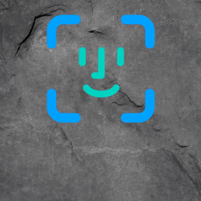

# Autenticação Facial - Reconhecimento Facial para Controle de Acesso
Situação [<s style="color: green;">Concluido</s>]

    

A Autenticação Facial é um sistema de controle de acesso baseado em reconhecimento facial que permite uma autenticação segura e conveniente usando biometria facial. Esse sistema oferece uma maneira confiável e eficiente de verificar a identidade das pessoas, concedendo acesso apenas a pessoal autorizado. Com a Autenticação Facial, você pode aprimorar a segurança de suas instalações, ao mesmo tempo em que simplifica o processo de controle de acesso.

## Recursos

- **Reconhecimento Facial:** Utilize algoritmos avançados de reconhecimento facial para identificar indivíduos com base em suas características faciais.
- **Controle de Acesso Seguro:** Garanta que apenas pessoas autorizadas possam acessar áreas ou recursos restritos.
- **Autenticação Conveniente:** Proporcione uma experiência de autenticação sem atritos para os usuários, eliminando a necessidade de métodos tradicionais de controle de acesso, como cartões-chave ou senhas.
- **Monitoramento em Tempo Real:** Monitore e acompanhe os registros de acesso e as atividades das pessoas em tempo real.
- **Integração:** Integre perfeitamente a Autenticação Facial com sistemas de controle de acesso existentes ou infraestrutura de segurança.

## Começando

Para usar a Autenticação Facial, siga estes passos:

1. Instale o sistema de Autenticação Facial no hardware ou servidor designado.
2. Configure o sistema, definindo os algoritmos de reconhecimento facial, regras de acesso e permissões.
3. Cadastre a biometria facial dos usuários autorizados, capturando suas imagens faciais.
4. Integre o sistema de Autenticação Facial à infraestrutura de controle de acesso existente, se necessário.
5. Implante o sistema e verifique se ele está corretamente conectado aos pontos de controle de acesso.
6. Os usuários poderão se autenticar apresentando seus rostos ao sistema de Autenticação Facial.
7. O sistema comparará a imagem facial capturada com os modelos biométricos cadastrados para conceder ou negar o acesso com base nas regras predefinidas.

## Requisitos

- Hardware para Autenticação Facial: Uma câmera ou conjunto de câmeras capazes de capturar imagens faciais de alta qualidade.
- Software de Reconhecimento Facial: Um algoritmo ou software de reconhecimento facial capaz de realizar detecção e reconhecimento facial em tempo real.
- Pontos de Controle de Acesso: Portas, portões ou outros mecanismos físicos de controle de acesso que possam ser integrados ao sistema de Autenticação Facial.
- Servidor ou Infraestrutura de Computação: Um servidor dedicado ou infraestrutura de computação para executar o software de Autenticação Facial.

## Limitações

- Fatores Ambientais: Condições de iluminação precárias, ângulos extremos ou obstruções podem afetar a precisão do reconhecimento facial.
- Cadastro de Usuários: O cadastro adequado da biometria facial dos usuários autorizados é fundamental para um reconhecimento e controle de acesso precisos.
- Falsos Positivos/Negativos: Em determinados cenários, o sistema pode produzir resultados falsos positivos ou fals

os negativos, exigindo ajuste adequado dos limiares de reconhecimento.
- Considerações Éticas: Garanta a conformidade com regulamentações de privacidade e proteção de dados ao coletar e processar os dados biométricos das pessoas.

## Licença

Este sistema de Autenticação Facial é lançado sob a [Licença Camys](https://github.com/pedrinbest/camysAuth).

## Reconhecimentos

O sistema de Autenticação Facial é construído com base em bibliotecas e algoritmos de código aberto, incluindo:

- [Python](https://www.python.org)
- [dlib](http://dlib.net/)
- [TensorFlow](https://www.tensorflow.org/)

## Contribuições

Contribuições são bem-vindas! Se você deseja contribuir para o sistema de Autenticação Facial.

## Suporte

Para qualquer dúvida ou problema, entre em contato com nossa equipe de suporte!

## Aviso Legal

O sistema de Autenticação Facial é fornecido "no estado em que se encontra", sem garantias de qualquer tipo. Use o sistema por sua conta e risco. Não nos responsabilizamos por danos ou consequências decorrentes do uso deste sistema.

--- 
